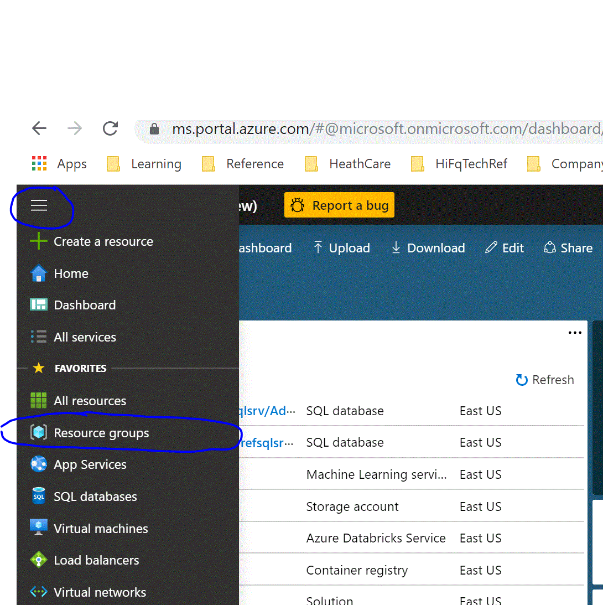
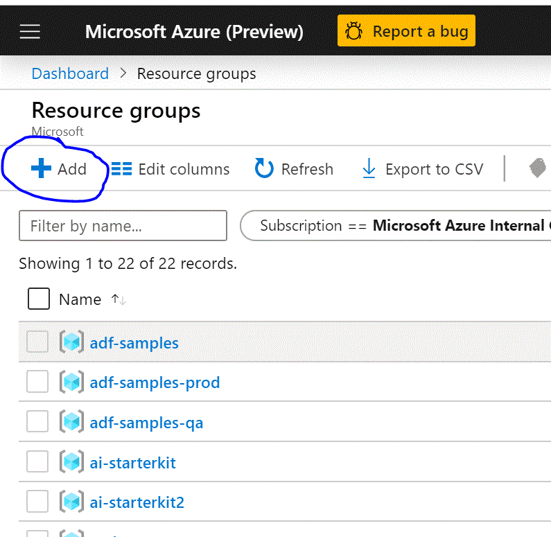
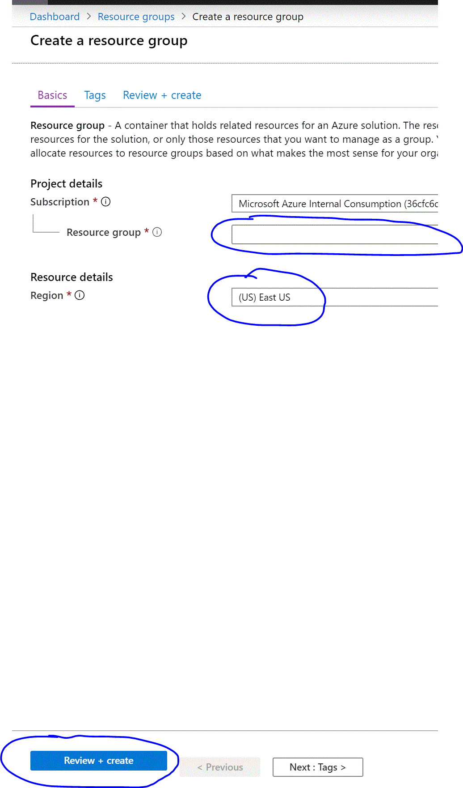
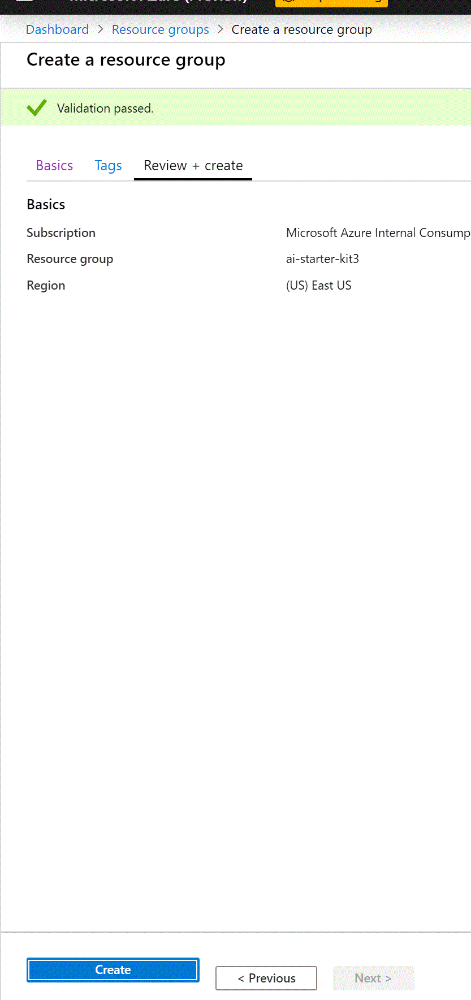
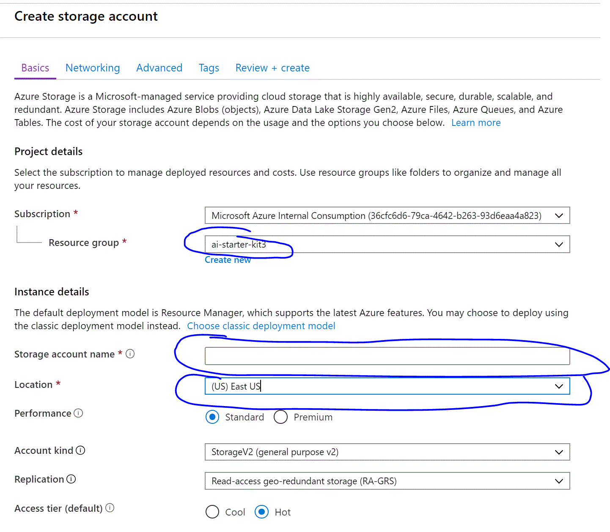
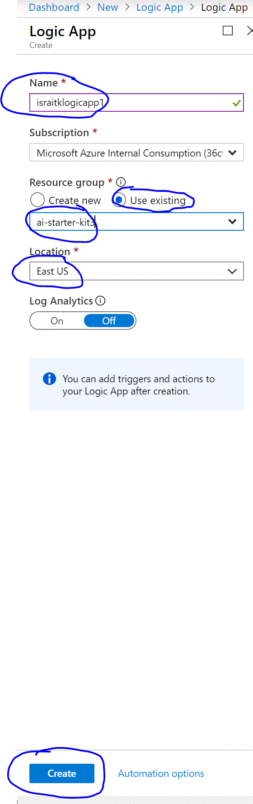
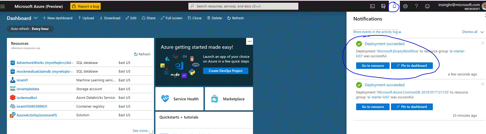
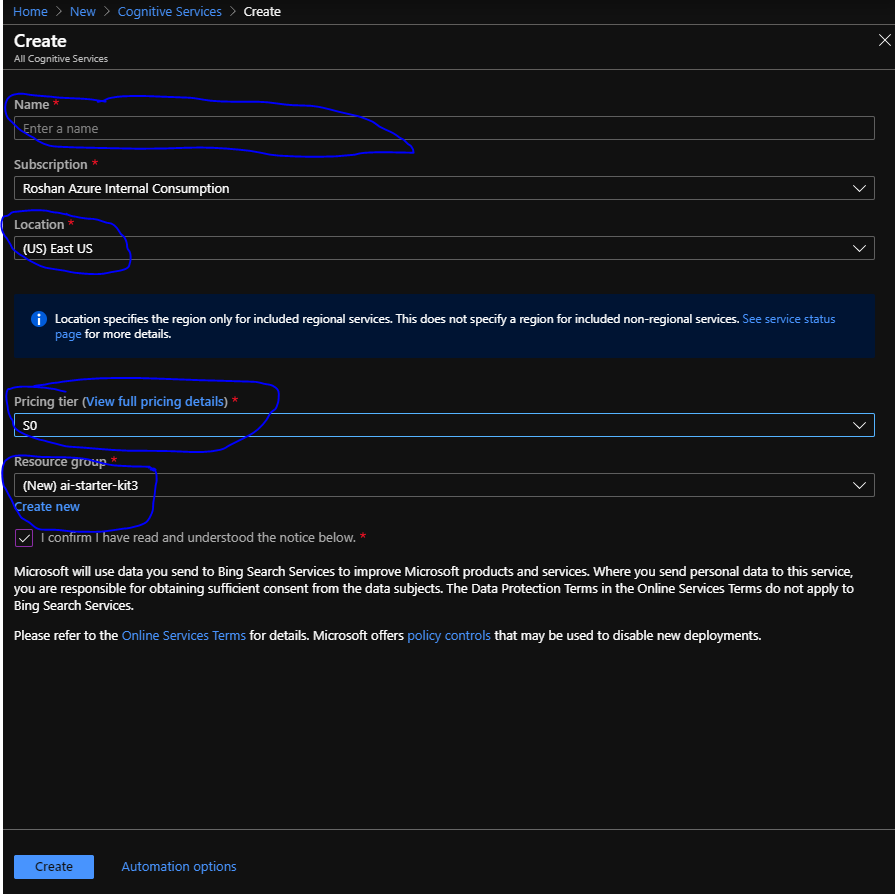
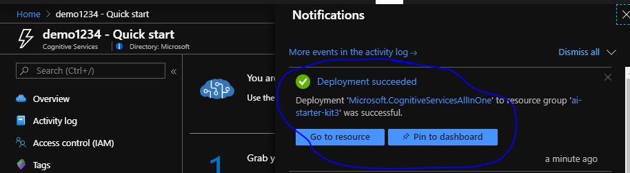

# Chapter 2 - Resource Creation

## Objective
Create Resources to be used for the solution in the subsequent chapters 

## Azure Concepts/Terms 

No AI capabilities will be added in this chapter, the work on this chapter lays out a framework which will be enhanced in the subsequent chapters. This chapter introduces you to a few critical Azure concepts.

* Resource Group - is a container that holds related resources for an Azure solution. The resource group includes those resources that you want to manage as a group. As part of this starter kit you will be creating a single resource group for all the resources.
* Azure Storage - is Microsoft's cloud storage solution for modern data storage scenarios, a storage account offers multiple ways to storage files and we will be uses Azure Blobs for the purpose of our purpose. 
* Logic App Service - is a cloud service that helps you automate tasks and workflows, for our purpose we will be using the Logic App to develop the background process which runs once the image is uploaded to Azure Storage. The solutions are developed using drag drop without coding effort,
* Cognitive Service - Cognitive Services bring AI within reach of every developer—without requiring machine-learning expertise. All it takes is an API call to embed the ability to see, hear, speak, search, understand, and accelerate decision-making into your apps.

## Learn More
* Resource Group - <https://docs.microsoft.com/en-us/azure/azure-resource-manager/resource-group-overview#resource-groups>
* Azure Storage - <https://docs.microsoft.com/en-us/azure/storage/>
* Logic App Service - <https://docs.microsoft.com/en-us/azure/logic-apps/>
* Cognitive Service - <https://azure.microsoft.com/en-us/services/cognitive-services/>

***

### Contents

* [Task 1: Create Resource Group](#task-1-create-resource-group)
* [Task 2: Create Storage Account](#task-2-create-storage-account)
* [Task 3: Create Logic App](#task-3-create-logic-app)
* [Task 4: Create Cognitive Service](#task-4-create-cognitive-service)

***

Sign in to the Azure Portal (if you don't have an Azure Subscription you can create one for free - <https://azure.microsoft.com/en-us/free/>)

### Task 1: Create Resource Group

All Resources for the solution will be created in a Resource Group
1. Expand the menu on the Azure Portal by clicking menu icon on top left corner and then click Resource Groups

2. Click *+ Add* button in the top left

3. Fill out the Resource Group details

	a. Enter name for the Resource Group of your choice

	b. Selct Region closest to you

	c. Click *Review + create* button on the bottom left

4. Review the entered Resource Group Details and click Create on the bottom left

5. Wait for the Resource Group creation confirmation pop-up to show on the top right and then proceed to the next Task

***

### Task 2: Create Storage Account
1. Expand the menu on the Azure Portal by clicking menu icon on top left corner and then click *+ Create a resource*

2. At this point Azure Portal should show New resouce creation screen
	
	a. Start typing *Storage Account*, as you are typing Storage Account selection will be displayed below the textbox

	b. Select Storage Account and Storage Account creation screen is displayed

	c. Click Create and Storage Account Detail screen is displayed

	d. Enter the Storage Account details - select the newly created Resource Group, specify storage account name which needs to be globally unique (add numbers like 123, 456, etc. whatever to make it unique), select location same as the resource group from Task 1, leave remaining selection as default and click *Review + create* button on bottom left

3. Review the Storage Account details and click *Create* button

4. Wait for the resource creation to complete and then proceed to the next Task

***

### Task 3: Create Logic App
An empty logic app will be created in this chapter so its pretty much a placeholder, triggers and actions will be added in subsequent chapters

1. Expand the menu on the Azure Portal by clicking menu icon on top left corner and then click *+ Create a resource*

2. At this point Azure Portal should show New resouce creation screen

	a. Start typing *logic app*, as you are typing Logic App selection will be displayed below the textbox

	b. Select Logic App and Logic App creation screen is displayed

	c. Click *Create* button and Logic App Detail screen is displayed

	d. Enter Logic App details - specify app name, for Resource Group select *Use exising* option and select the resource group created in Task 1 above, select Location the same as the Task 1, leave remaining selection as default and click *Create* button on bottom left

4. Wait for the resource creation to complete, notification section on Azure Portal shows the resource creation progress 

***
### Task 4: Create Cognitive Service
1. Expand the menu on the Azure Portal by clicking menu icon on top left corner and then click + Create a resource

2. At this point Azure Portal should show New resource creation screen

	a. Start typing Cognitive Services, as you are typing Cognitive Services selection will be displayed below the textbox.
	
	b. Select Cognitive Services and Create All Cognitive Services screen is displayed (there are many different Cognitive Services, instructions guide you to create All Cognitive Services type which is important detail to keep in mind, this allows multiple Cognitive Services to be used with the same key which is a simplistic option for development).
	
	c. Enter the Cognitive Services detail - specify name of the service which needs to be globally unique, select location same as the resource group from Task 1, select pricing tier, select the Resource Group created in Task 1 and click *Create* button on bottom left.    
	
	
	
	d. Wait for the resource creation to complete, notification section on Azure Portal shows the resource creation progress.
	
	

## Review
In this chapter we created resources which will be used in building the solution in the subsequent chapters, at this stage the resources are empty and don't have any content. You created the following resources: 
* Resource Group
* Storage Account 
* Logic App
* Cognitive Services

### Resource Group Detail Page
As explained before Resource Group is a logical container for resources, it provides an easy way to organize and find resources related to a particular project and in this case related to the starter kit. In the subsequent chapters, the resources created here will need to be looked up and following are the instructions on how to go to the Resource Group detail page which is one method of looking up previously created resource (subsequent chapter do refer to this section when there is a need to find a resource).

1. Expand the menu on the Azure Portal by clicking menu icon on top left corner and then click *Resource Groups*.

2. List of all Resource Groups is displayed.

3. Click the Resource Group used for this starter kit (created in Task 1 above) and list of all the resources related to the starter kit are displayed.

***

[Previous Chapter](../chapter1/Readme.md) | [Next Chapter](../chapter3/Readme.md)
