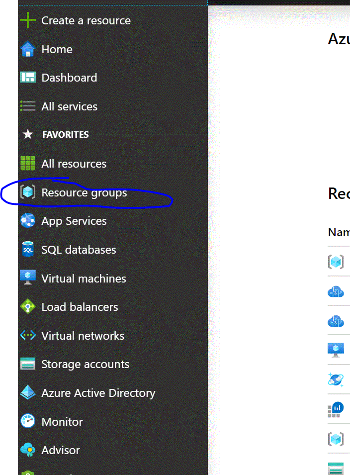
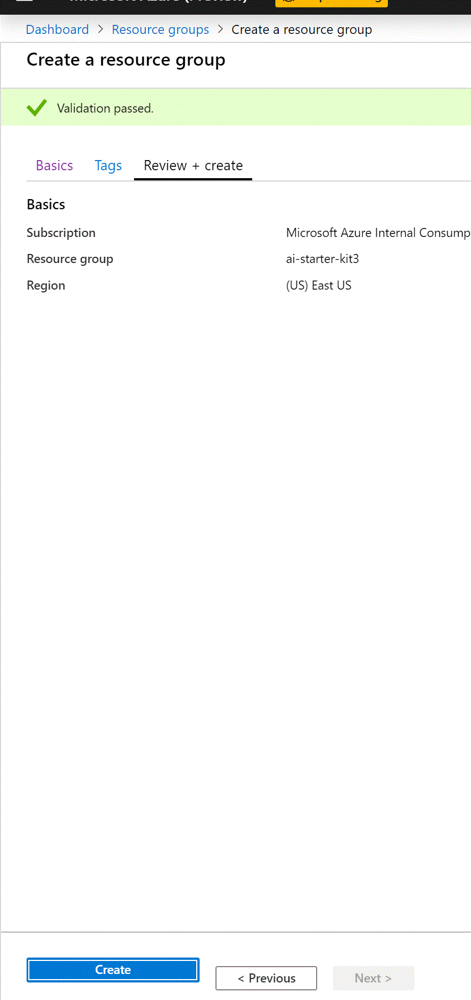

# Chapter 2 - Upload Image and run the process to save Information to Database

## Objective
Upload a Medicine bottle image to Azure Storage Account and have a record created in Azure CosmosDB Database with location of the image on the storage account

## Azure Concepts/Terms 

No AI capabilities will be added in this chapter, the work on this chapter lays out a framework which will be enhanced in the subsequent chapters. This chapter introduces you to a few critical Azure concepts.

* Resource Group - is a container that holds related resources for an Azure solution. The resource group includes those resources that you want to manage as a group. As part of this starter kit you will be creating a single resource group for all the resources.
* Azure Storage - is Microsoft's cloud storage solution for modern data storage scenarios, a storage account offers multiple ways to storage files and we will be uses Azure Blobs for the purpose of our purpose. 
* CosmosDb  - is a fully managed NoSQL database service which allows saving documents without the need to design table in rigid formats and provides superior querying capabilities where saved information can be looked up easily in a performant manner.
* Logic App Service - is a cloud service that helps you automate tasks and workflows, for our purpose we will be using the Logic App to develop the background process which runs once the image is uploaded to Azure Storage. The solutions are developed using drag drop without coding effort,

## Learn More
* Resource Group - <https://docs.microsoft.com/en-us/azure/azure-resource-manager/resource-group-overview#resource-groups>
* Azure Storage - <https://docs.microsoft.com/en-us/azure/storage/>
* CosmosDb - <https://docs.microsoft.com/en-us/azure/cosmos-db/>
* Logic App Service - <https://docs.microsoft.com/en-us/azure/logic-apps/>

## Architecture Diagram
> TODO: Architecture Diagram

## Exercise

> TODO: This section is not completed, on the Logic App step it will get bigger with details on how to implement with screenshots 

***

### Contents

* [Task 1: Create Resource Group](#Task-1:-Create-Resource-Group)
* [Task 2: Create Storage Account](#Task-2:-Create-Storage-Account)

***

Sign in to the Azure Portal (if you don't have an Azure Subscription you can create one for free - <https://azure.microsoft.com/en-us/free/>)

### **Task 1: Create Resource Group**

All Resources for the solution will be created in a Resource Group
1. Expand the menu on the Azure Portal by clicking menu icon on top left corner and then click Resource Groups

2. Click *+ Add* button in the top left

3. Fill out the Resource Group details

	a. Enter name for the Resource Group of your choice

	b. Selct Region closest to you

	c. Click *Review + create* button on the bottom left

4. Review the entered Resource Group Details and click Create on the bottom left

5. Wait for the Resource Group creation confirmation pop-up to show on the top right and then proceed to the next Task

### **Task 2: Create Storage Account**
1. Expand the menu on the Azure Portal by clicking menu icon on top left corner and then click *+ Create a resource*

2. At this point Azure Portal should show New resouce creation screen
	a. Start typing *Storage Account*, as you are typing Storage Account selection will be displayed below the textbox

	b. Select Storage Account and Storage Account creation screen is displayed

	c. Click Create and Storage Account Detail screen is displayed

	d. Enter the Storage Account details - select the newly created Resource Group, specify storage account name which needs to be globally unique (add numbers like 123, 456, etc. whatever to make it unique), select location same as the resource group from Task 1, leave remaining selection as default and click *Review + create* button on bottom left

3. Review the Storage Account details and click *Create* button

4. Wait for the resource creation to complete and then proceed to the next Task

### **Task 3: Create Cosmos DB Account**

1. Expand the menu on the Azure Portal by clicking menu icon on top left corner and then click *+ Create a resource*

2. At this point Azure Portal should show New resouce creation screen
	a. Start typing *cosmos*, as you are typing Azure Cosmos DB selection will be displayed below the textbox

	b. Select Azure Cosmos DB and Cosmos DB creation screen is displayed

	c. Click *Create* button and Cosmos DB Detail screen is displayed

	d. Enter the Cosmos DB account details - select the resource group created in Task 1 above, specify unique account name, for API select *Core(SQL), select Location the same as the Task 1, leave remaining selection as default and click *Review + create* button on bottom left

3. Review the Cosmos DB details and click *Create* button

4. Wait for the resource creation to complete and then proceed to the next Task

<!--
* Task 4 - Create Logic App
	* Configure EventGrid Trigger to run when file loaded to Blob Storage
	* Configure CosmosDb Connect to create record with path to medicine image file on Blob storage
-->

[Back to Chapter 1](../chapter1-introduction.md)