# Chapter 3 - Create an Azure Function for Reading Text from a Prescription Image

## Objective
The business objective here is to read text from a prescription image. We'll use an Azure Function to do this. (It's a simple function, the C# code is provided for you so no coding experience is required). The code in Azure Function uses Azure AI Platform capabilies available as part of our Compute Vision Cognitive Service. At the end of chapter, you will be able use the AI Capabilities to read text from and image.

## Azure Concepts/Terms
* Azure Functions - Azure Functions is a solution for easily running small pieces of code, or "functions," in the cloud. It's server-less so you can write just the code you need for the problem at hand without worrying about a whole application or the infrastructure to run it.

* Azure Cognitive Services -  we've assembled a set of services which bring AI within reach of every developer—without requiring machine-learning expertise. All it takes is an API call to embed the ability to see, hear, speak, search, understand, and accelerate decision-making into your apps.

* Azure Computer Vision Cognitive Service - Computer Vision is one of the Cognitive Services. It uses machine learning to read text from an image.

## Learn More
* Azure Functions - <https://docs.microsoft.com/en-us/azure/azure-functions/functions-overview>
* Azure Cognitive Services - <https://docs.microsoft.com/en-us/azure/cognitive-services/>
* Azure Computer Vision Cognitive Services - <https://docs.microsoft.com/en-us/azure/cognitive-services/computer-vision/>

***

### Contents

* [Task 1: Create Read Text from Image Azure Function](#task-1-create-read-text-from-image-azure-function)
* [Task 2: Specify Configuration settings for Read Text from Image Azure Function](#task-2-specify-configuration-settings-for-read-text-from-image-azure-function)
* [Task 3: Deploy Azure Function Code](#task-3-deploy-azure-function-code)
* [Task 4: Test Azure Function](#task-4-test-azure-function)

***

### Task 1: Create Read Text from Image Azure Function

In this task you will create an empty Azure Function Resource.

1. Expand the menu on the Azure Portal by clicking the menu icon in the top left corner and then click *+ Create a resource*

2. The Azure Portal should show the New resource creation screen
	
	a. Start typing *Function*. As you are typing, *Function App* selection will be displayed below the textbox.

	b. Select *Function App* and Function App creation screen is displayed.

	c. Click *Create* and Function App Details screen is displayed.

	d. Enter the details - select the Resource Group created in Chapter 2. Enter a name for your function - which needs to be globally unique. (Add numbers like 123, your dog's name, or whatever to make it unique.) Select a Region. (It's not necessary, but you should probably make it the same as your Resource Group's region.) Select *.Net Core* for Runtime stack. Leave the rest of the options with their default settings and click the *Review + create* button on the bottom left.

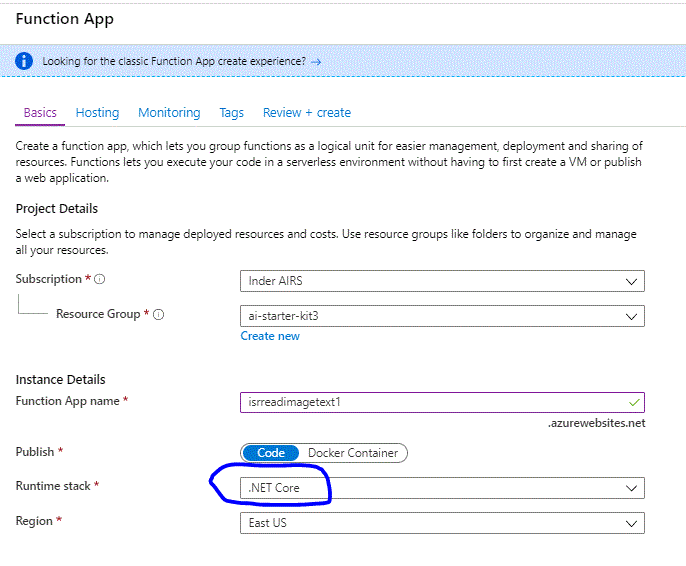

3. Review the Azure Function details: Runtime Stack must be .NET Core, Plan Type must be Consumption, Operating System and Application Insights must be Enabled (if any of the settings are different you can go back to the Preview screen and make appropriate selections).

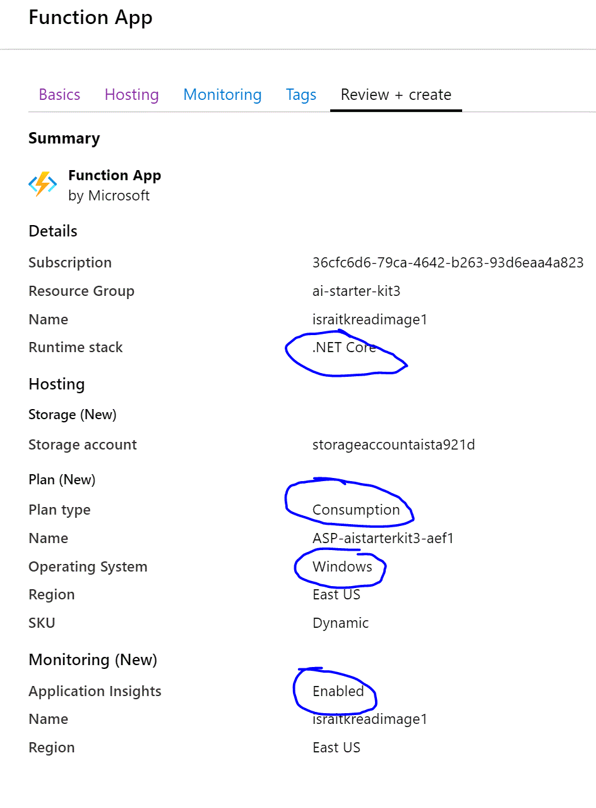

4. Click the *Create* button.

5. Wait for the resource creation to complete and then proceed to the next Task.

***

### Task 2: Specify Configuration settings for Read Text from Image Azure Function

In this task you will specify a few configuration settings to the Azure Function resource created in the previous task.

1. Browse to the Azure Function detail page on the Azure Portal by clicking *Go to resource* button from the deployment screen or from the Resource Group detail screen. (See Chapter 2 for steps to browse to the Resource Group Detail screen.)

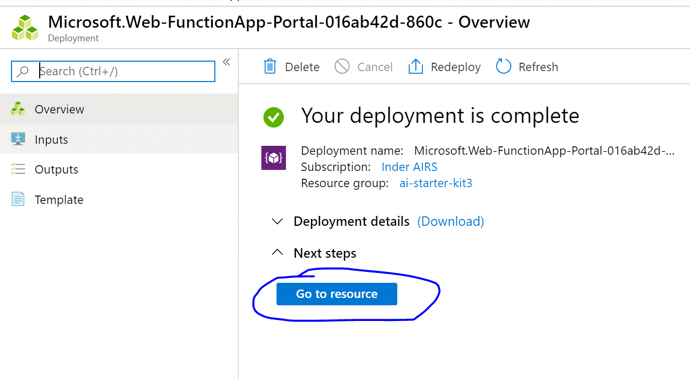

2. Click *Configuration* link under the *Configuration features* section

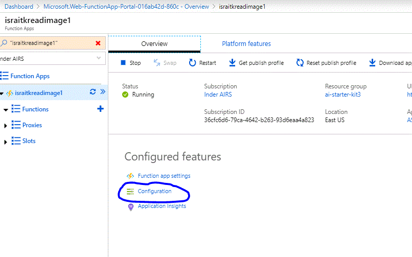

3. A total of 4 Application Settings need to be added for Read Text from Image Azure Function. Click *+ New application setting* button to add each of the following settings one by one.
    
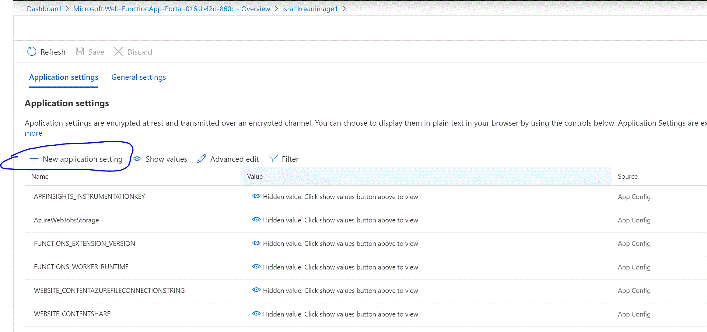

When adding application settings it's critical you use the exact name of the setting as specified below so copy/paste to avoid typing mistakes.

4. Add Storage Connection String Setting - Specify name of the setting **StorageConnectionString** and set the value to connection string of the Storage Account found on the **Access Keys** page of the Storage Account (see the second screenshot on how to lookup the Storage Account Connection String).

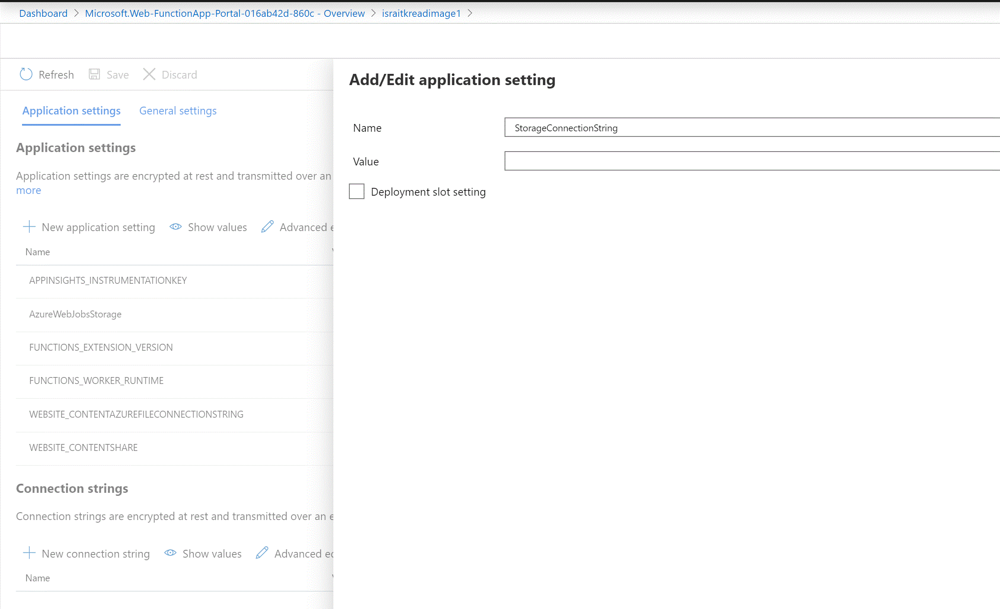

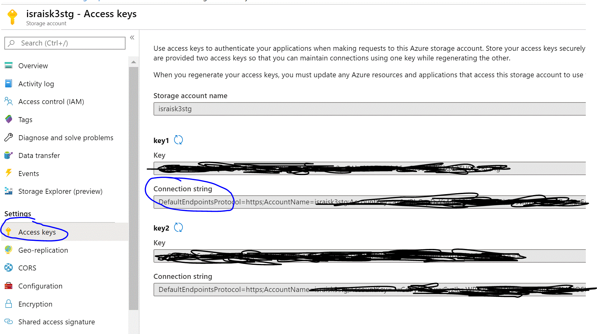

5. Add Cognitive Service Key Settting - Specify name of the setting **CognitiveServiceKey** and set the value to the key of the Cognitive Service found from **Keys** page of the Cognitive Service.

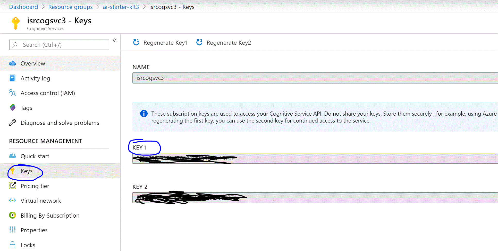

6. Add Cognitive Service Endpoint Setting - Specify name of the setting **CognitiveServiceEndpoint** and set the value to the Endpoint for the Cognitive Service.

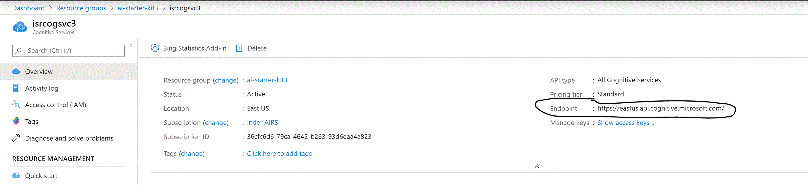

7. Add Project setting - Specify name of the setting **PROJECT** and set the value as **code/MyMedAIStarterKit_Soln/ReadImageTextFuncApp**. This setting is used for deploying the code to Azure Function

*Note: Don't forget to click the *Save* button after adding all the settings.*

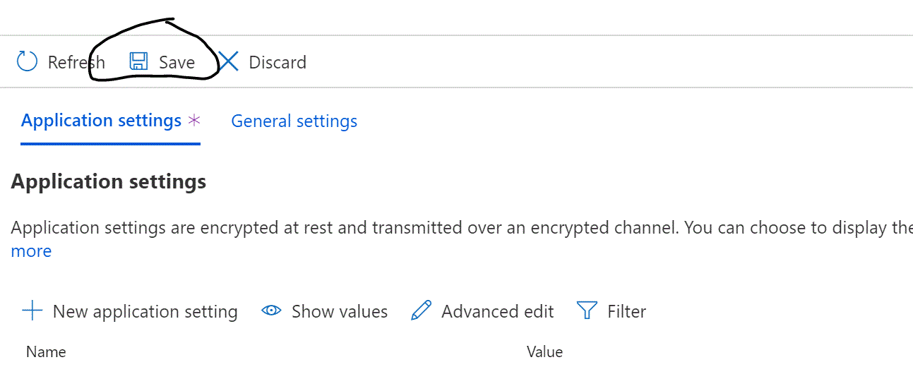

***

### Task 3: Deploy Azure Function Code

In this task you will add the code to the Azure Function resoruce so that the function can be used to read text from image.

1. On the Azure Function Detail page, click *Platform features* tab and then click *Container settings* under *Code Deployment* section

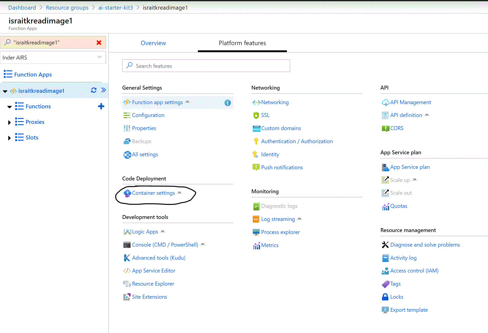

2. Code will be deployed from Public Github Repo so select *External* under *Manual Deployment (push/sync) section and then click *Continue* button at the bottom.

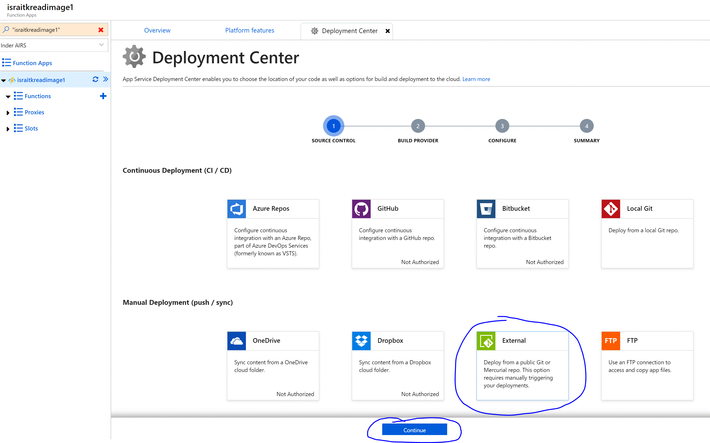

3. Select *App Service build service* for Build Provider and then click *Continue* button at the bottom.


4. Specify the Code Repository configuration - specify *https://github.com/isinghrana/ai-starterkit-mymeds* for Repository, *master* for Branch, leave Repository Type as *Git* and specify No for Private Repository. 

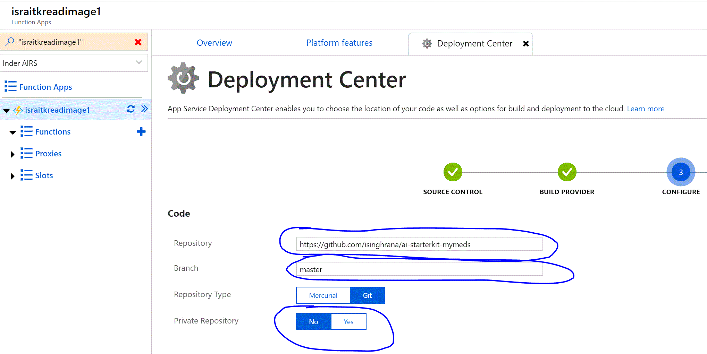

5. Click *Continue* and then *Finish* button, this starts the deployment of the code to your Azure Function. Wait for the deployment to succeed and the proceed to the next task, screenshot below shows a Successful deployment

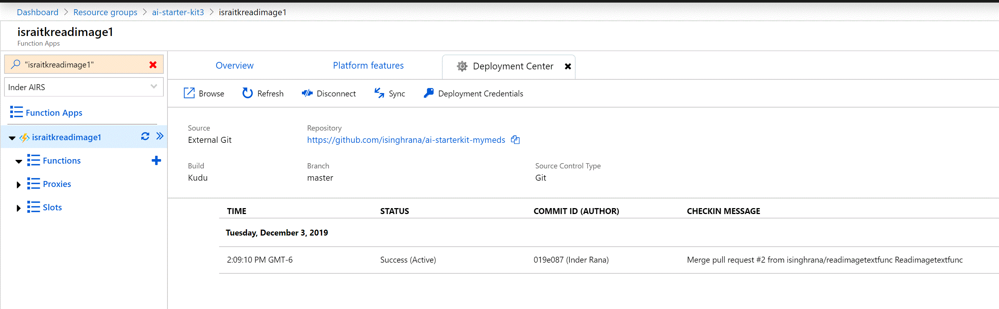

***

### Task 4: Test Azure Function

In this task, you will upload a test image to Storage Account and then invoke Azure Function to read text from the image. 

1. Download the test image file to your local computer. Right-click the image below and select *Save Image as...* option.

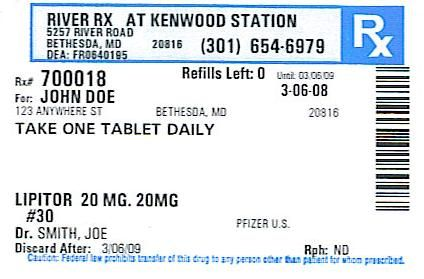

2. Browse to the detail page for Storage Account created in Chapter 2, click Containers and the click *+ Container* 

3. In this context, a Container can be considered a top-level folder in a Storage Account, give an appropriate name to the container. Example - *test-images*.

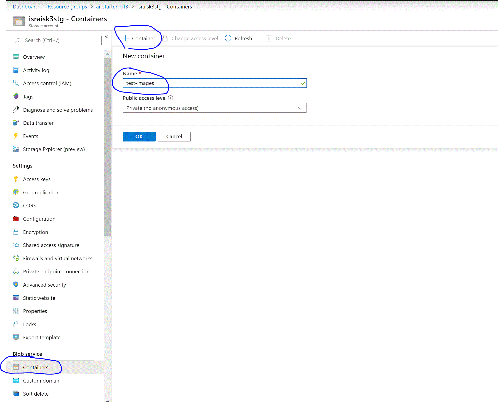

4. Click the newly created folder and click *Upload* button on the toolbar to upload the test image downloaded in Step 1 above.

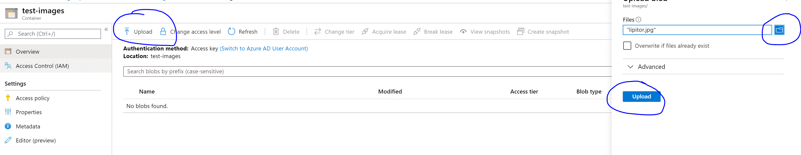

5. Close the Upload dialog on the right side, click the elipsis *...* next to the test image file to open menu, and click *Properties* and the copy the URL for the file.

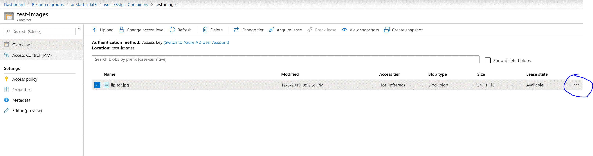

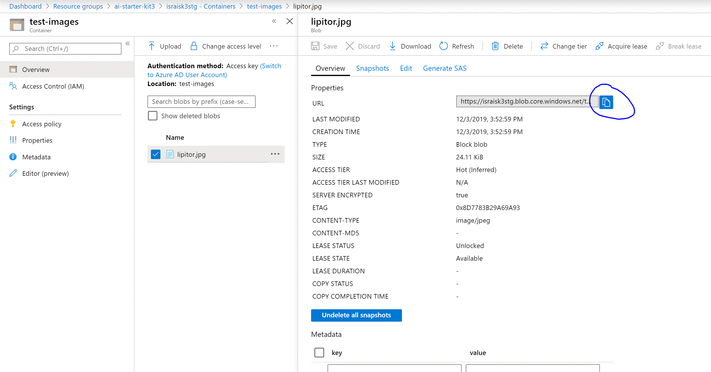

6. Browse to the Azure Function detail page, select the Function and click *Test* tab on the right side to open the Test Dialog.

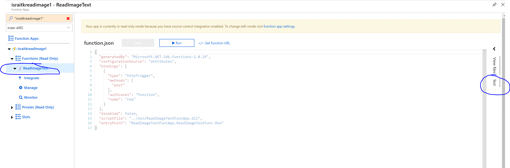

7. Copy the code snippet below and paste into the *Request Body* text box, replace the placeholder text (Paste the Test Image....) with URL of the test image from Step 5 and click *Run* button. Verify that output contains test from the image. 

```
{
    "blobUrl": "<Paste Test Image URL from Step 5 here>"
}
```

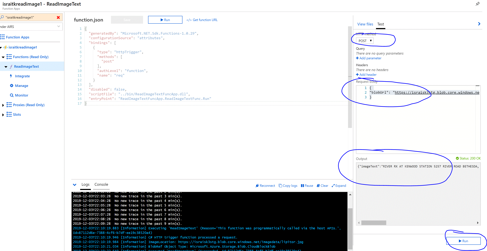

***

**Congratulations! At this point, you have implemented an Azure Function which uses AI Capabilities of Azure Computer Vision Cognitive Service to read text from an image.**

***

[Previous Chapter](../chapter2/Readme.md) | [Next Chapter](../chapter4/Readme.md)
