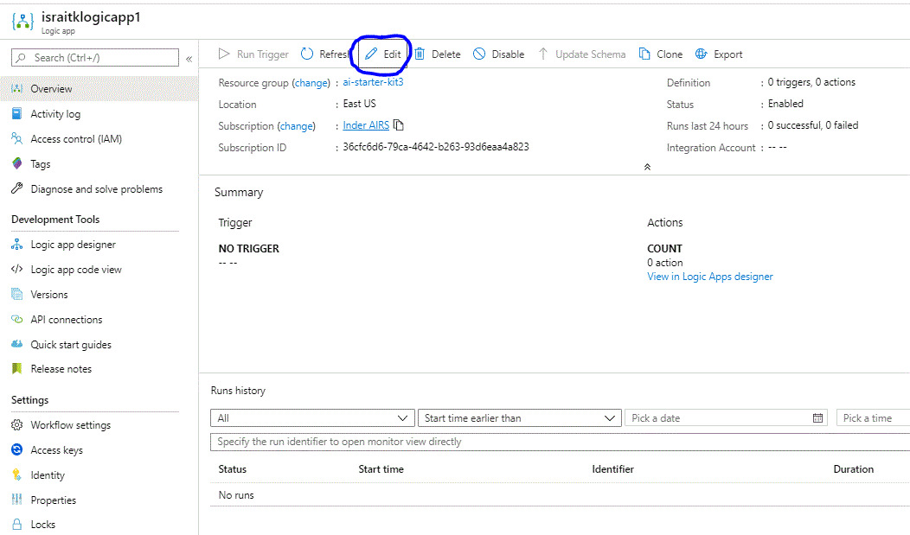
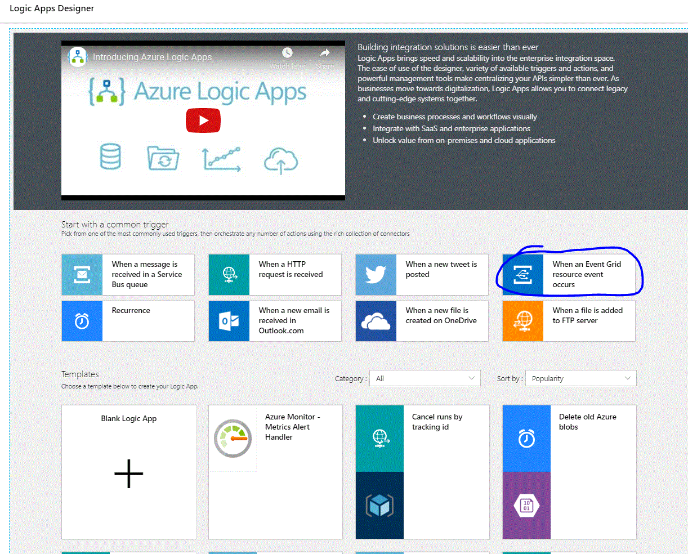
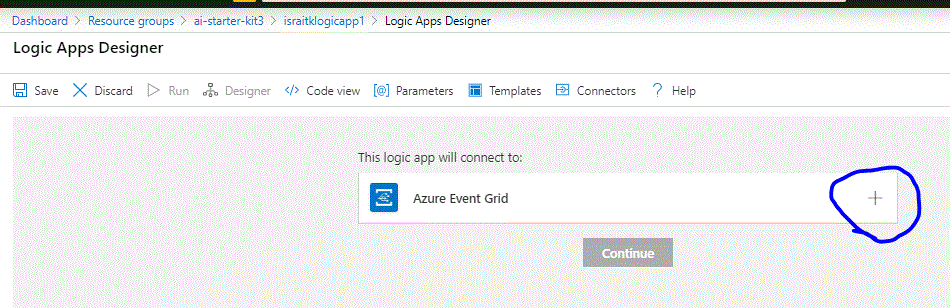
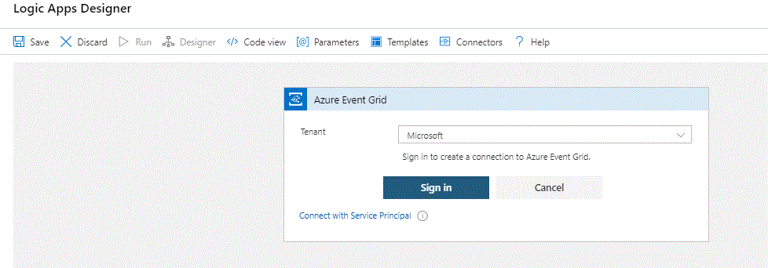
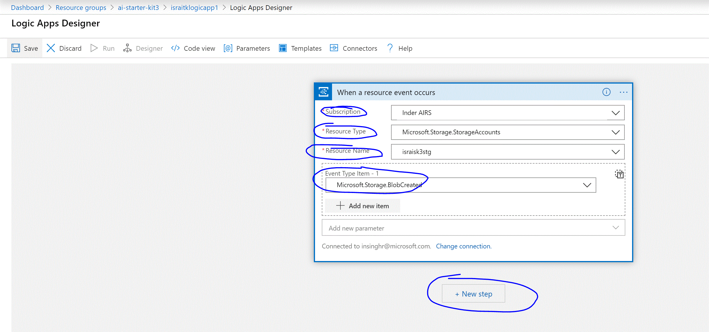
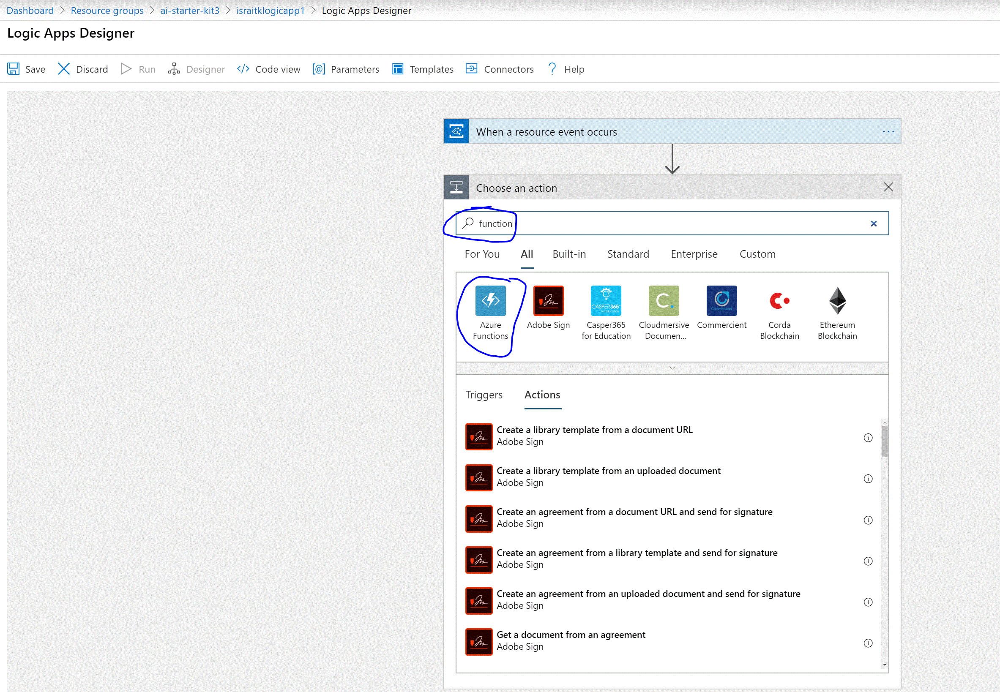
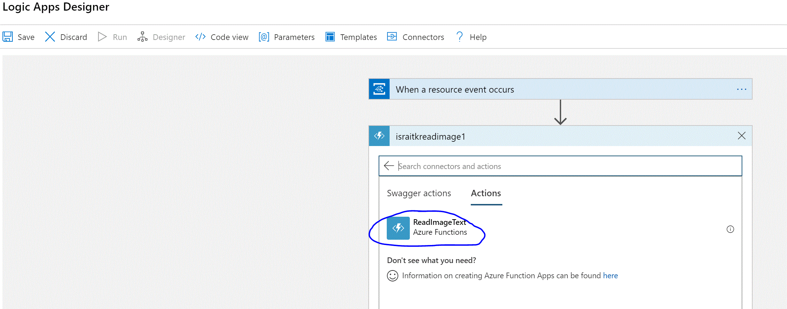
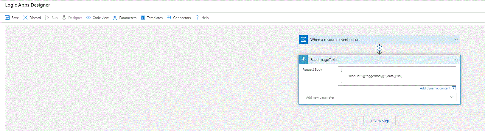

# Chapter 4 - Create Logic App to invoke ReadImageText Azure Function on image uploaded to Azure Storage Account

## Objective
Create Logic App to run when a new image is uploaded to Azure Storage Account. The Logic App invokes the Read Text from Image Azure Function (created in previous chapter) to read the text from image. 

> Note: In the subsequent chapters this Logic App will be further enhanced with steps where AI is used to identify the Medicine informaton from the image text.

***

### Contents

* [Task 1: Add Trigger to run the Logic App on image upload to Azure Storage](#task-1-add-trigger-to-run-the-logic-app-on-image-upload-to-azure-storage)
* [Task 2: Invoke Read Text from Image Azure Function](#Task-2-invoke-read-text-from-image-azure-function)

***

### Task 1: Add Trigger to run the Logic App on image upload to Azure Storage 

In this task you will add a trigger to run Logic App when an image is uploaded to Azure Storage account using Event Grid Trigger. An empty Logic App was created in Chapter 2, you will be adding to that empty Logic App. You will need to know the Storage Account Name and Container where you will be uploading the test images, this can be the same Container created in Chapter 3 Task 4 for testing Read Text from Image Azure Function.

1. Browse to Logic App detail page on Azure Portal (one method to find Logic App is to browse to Resource Group detail screen instructions for which are documented on Chapter 2).

2. Click *Edit* button to open the Logic App Designer page.



3. On Logic App Designer page, select *When an Event Grid resource event occurs* tile under *Start with common trigger* section.



4. Click the *+* sign next to Azure Event Grid block on the designer, sign-in to the Azure AD (this is the same account you logged into Azure Portal, most likely you have access to only one tenant so the defualt selection of the tenant dropdown should suffice) and then click Continue button.





5. Configure the Event Grid Trigger to fire on image upload to the Azure Storage Account.

    a. Select your Azure Subscription 

    b. Select *Microsoft.Storage.StorageAccounts* for Resource Type

    c. Select *Microsoft.Storage.BlobCreated* Event for Event Type



At this point you have Logic App configured to run when an image is uploaded to storage account.

***

### Task 2: Invoke Read Text from Image Azure Function 

In this task you will add action step to the Logic App to invoke Azure Function to read text from uploaded image.

1. Click *+ New Step* button on the Logic App Designer

2. Type *function* in the Choose an action box and select *Azure Function* action



3. List of Azure Function Apps from your Azure Subscription is displayed, select the Function App created in Chapter 3. A list of functions in the Function App will be displayed, *ReadImageText* should be the only function and needs to be selected.



4. For ReadImageText step, add the following text in the *Request Body* text box, this causes the URL of the test image uploaded to Azure Storage to be passed to the Azure Function at runtime.

```
{
	"blobUrl": @triggerBody()?['data']['url']
}
```



***


### Task 3: Test Logic App


