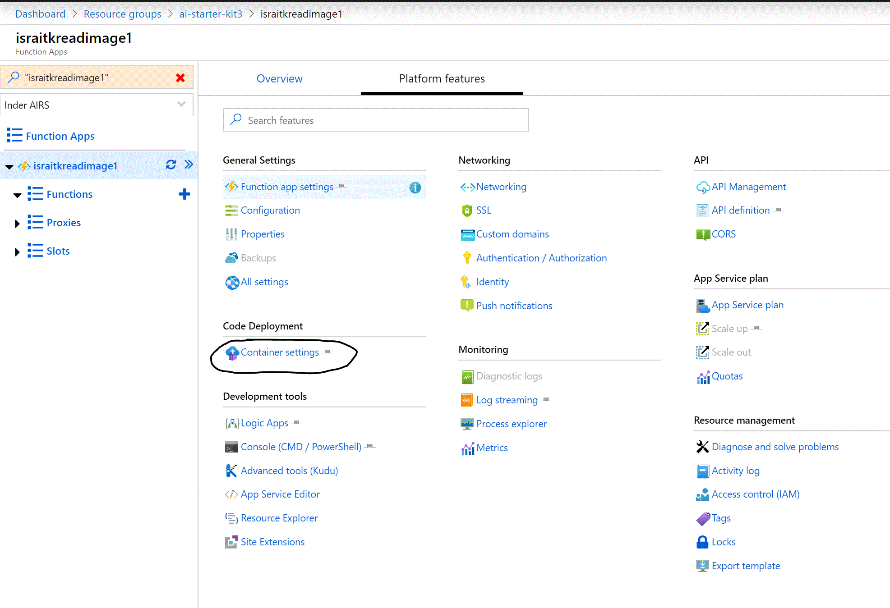
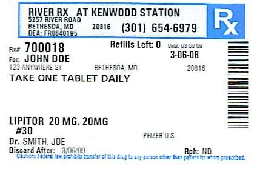

# Chapter 4 - Deploy and Test Azure Function for Reading Text from a Prescription Image

## Objective
The business objective is to read text from a prescription image. In this chatper we will deploy the code for Azure Function and test it to read text from image using AI Capabilties of Azure Computer Vision Cognitive Service.


### Contents

* [Task 1: Deploy Azure Function Code](#task-1-deploy-azure-function-code)
* [Task 2: Test Azure Function](#task-2-test-azure-function)

***

### Task 1: Deploy Azure Function Code

In this task you will add the code to the Azure Function resoruce so that the function can be used to read text from image.

1. On the Azure Function Detail page, click **_Platform features_** tab and then click **_Container settings_** under **_Code Deployment_** section



2. Code will be deployed from Public Github Repo so select **_External_** under **_Manual Deployment (push/sync)_** section and then click **_Continue_** button at the bottom.


3. Select **_App Service build service_** for Build Provider and then click **_Continue_** button at the bottom.


4. Specify the Code Repository configuration - specify **_https://github.com/isinghrana/ai-starterkit-mymeds_** for Repository, **_master_** for Branch, leave Repository Type as **_Git_** and specify No for Private Repository. 


5. Click **_Continue_** and then *Finish* button, this starts the deployment of the code to your Azure Function. Wait for the deployment to succeed and the proceed to the next task, screenshot below shows a Successful deployment


***

### Task 2: Test Azure Function

In this task, you will upload a test image to Storage Account and then invoke Azure Function to read text from the image. 

1. Download the test image file to your local computer. Right-click the image below and select **_Save Image as..._** option.



2. Browse to the detail page for Storage Account created in Chapter 2, click Containers and the click **_+ Container_** 

3. In this context, a Container can be considered a top-level folder in a Storage Account, give an appropriate name to the container. Example - **_test-images_**.


4. Click the newly created folder and click **_Upload_** button on the toolbar to upload the test image downloaded in Step 1 above.


5. Close the Upload dialog on the right side, click the elipsis **_..._** next to the test image file to open menu, and click **_Properties_** and the copy the URL for the file.


6. Browse to the Azure Function detail page, select the Function and click **_Test_** tab on the right side to open the Test Dialog.


7. Copy the code snippet below and paste into the **_Request Body_** text box, replace the placeholder text (Paste the Test Image....) with URL of the test image from Step 5 and click *Run* button. Verify that output contains test from the image. 

```
{
    "blobUrl": "<Paste Test Image URL from Step 5 here>"
}
```


***

## Review 

**_Congratulations!_ At this point, you have implemented an Azure Function which uses AI Capabilities of Azure Computer Vision Cognitive Service to read text from an image.**

***

[Previous Chapter](../chapter3/Readme.md) | [Next Chapter](../chapter5/Readme.md)
