# Chapter 5 - Implement Logic App to read text from image

## Objective
The business objective is to take action when an prescription label image is uploaded. You'll create a Logic App to run when a new image is uploaded to Azure Storage Account. The Logic App invokes the Read Text from Image Azure Function (created in previous chapter) to read the text from image.

The following diagram shows section of the overall solution which will be operational by end of this chapter. You will have a functional Logic App which automatically runs as soon as the image is uploaded to Azure Storage Account, it will use Azure Function and Computer Vision Cognitive Service to read text from the prescription image.

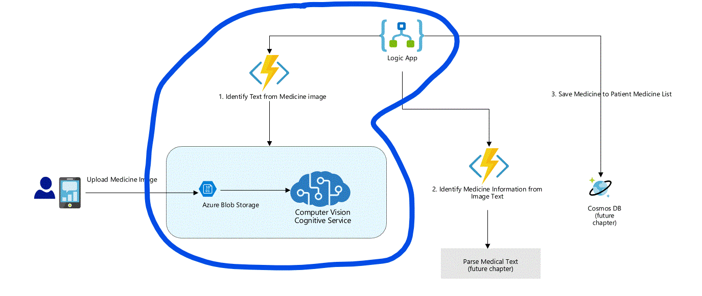


> Note: In the subsequent chapters, this Logic App will be further enhanced with steps where AI is used to identify the Medicine informaton from the image text.

***
## Azure Concepts/Terms 

* Logic Apps - Logic Apps are a no-code / low-code solution for building workflows. A workflow is made up of one or more steps/actions.  These workflows can be run on a schedule or triggered by an event (such as when an image is uploaded to Azure).

### Contents

* [Task 1: Add a Trigger to run the Logic App on image upload to Azure Storage](#task-1-add-trigger-to-run-the-logic-app-on-image-upload-to-azure-storage)
* [Task 2: Add Step to Invoke Read Text from Image Azure Function](#task-2-add-step-to-invoke-read-text-from-image-azure-function)
* [Task 3: Test Logic App](#task-3-test-logic-app)

***

### Task 1: Add a Trigger to run the Logic App on image upload to Azure Storage 

In this task, you will add a trigger to run your Logic App when an image is uploaded to your Azure Storage account using Event Grid Trigger. An empty Logic App was created in Chapter 2 so you will be adding steps to it now. You will need to know the Storage Account Name and Container where you will be uploading the test images. We recommend you use the same Storage Container created in Chapter 3 Task 4 for testing Read Text from Image Azure Function.

1. Browse to your Logic App's detail page on the Azure Portal. (One way to find your Logic App is to browse to your Resource Group detail screen. Instructions for doing so are documented in Chapter 2).

2. Click *Edit* button to open the Logic App Designer page.

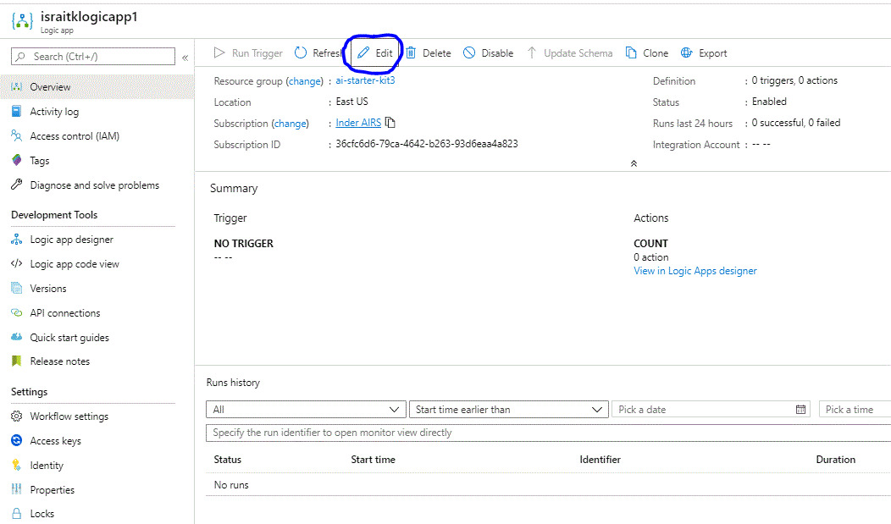

3. On Logic App Designer page, select *When an Event Grid resource event occurs* tile under *Start with common trigger* section.

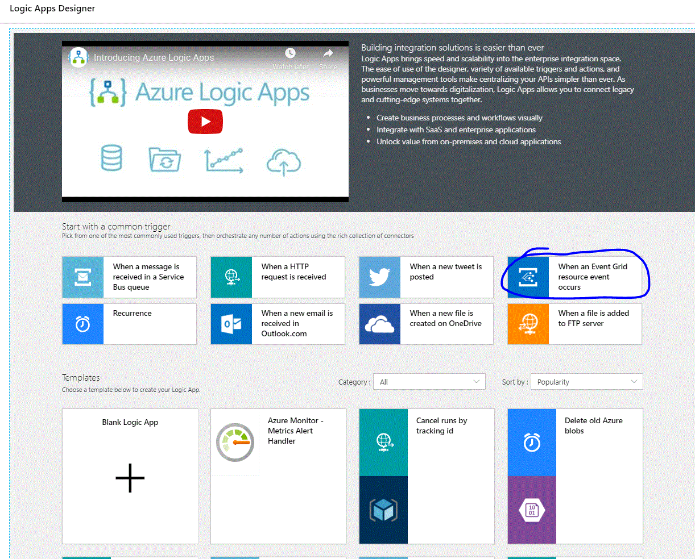

4. Click the *+* sign next to Azure Event Grid block on the designer, sign-in to the Azure AD (this is the same account you logged into Azure Portal, most likely you have access to only one tenant so the defualt selection of the tenant dropdown should suffice) and then click Continue button.

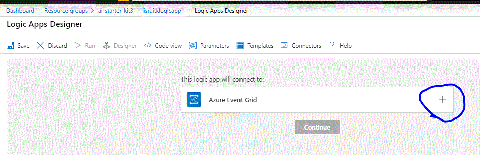

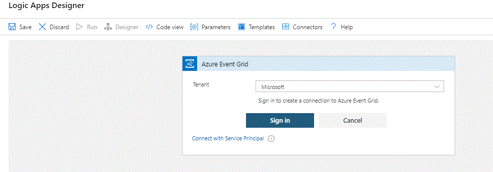

5. Configure the Event Grid Trigger to fire on image upload to the Azure Storage Account.

    a. Select your Azure Subscription 

    b. Select *Microsoft.Storage.StorageAccounts* for Resource Type

    c. Select *Microsoft.Storage.BlobCreated* Event for Event Type

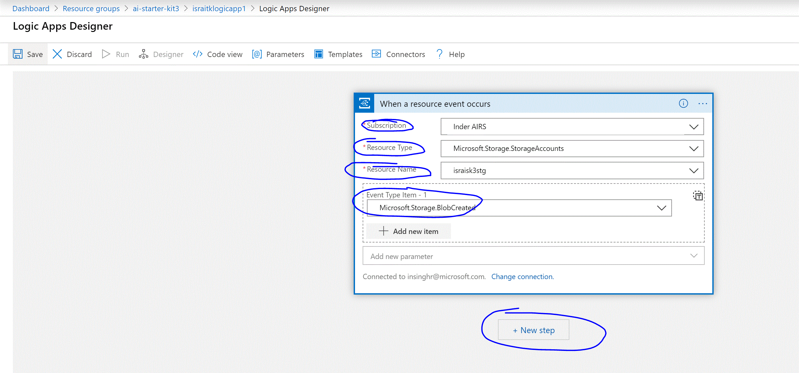

At this point, you have a Logic App configured to run when an image is uploaded to storage account.

***

### Task 2: Add Step to Invoke Read Text from Image Azure Function 

In this task, you will add action step to the Logic App to invoke Azure Function to read text from uploaded image.

1. Click *+ New Step* button on the Logic App Designer

2. Type *function* in the Choose an action box and select *Azure Function* action

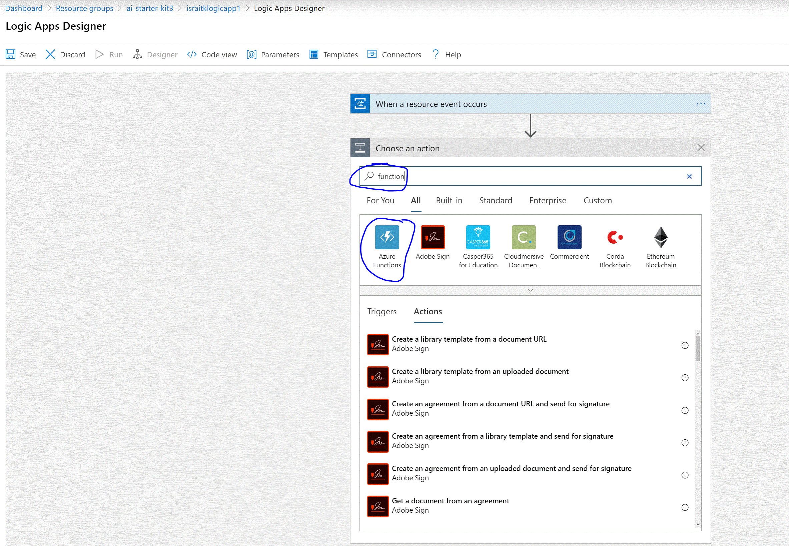

3. A list of Azure Function Apps from your Azure Subscription is displayed. Select the Function App created in Chapter 3. A list of functions in the Function App will be displayed, *ReadImageText* should be the only function and needs to be selected.

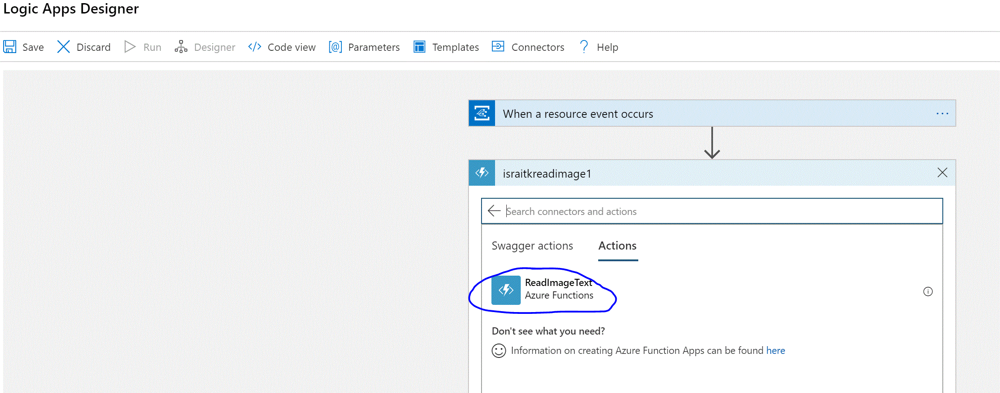

4. For ReadImageText step, add the following text in the *Request Body* text box. This causes the URL of the test image uploaded to Azure Storage to be passed to the Azure Function at runtime.

```
{
	"blobUrl": @triggerBody()?['data']['url']
}
```

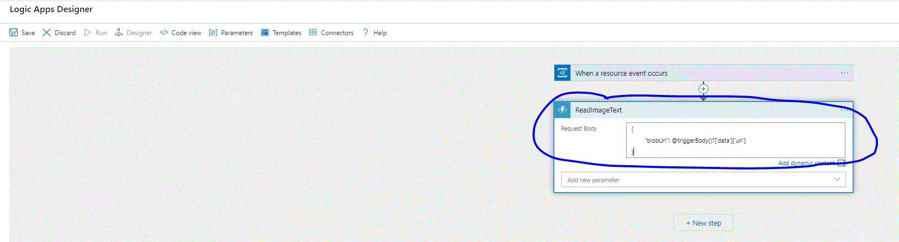

***

### Task 3: Test Logic App

In this task, you will be upload another test image to Azure Storage Account and verify Logic App executes successfully and invokes ReadImageText Azure Function to get the text for the image.

1. Download the following image by right-clicking and select *Save Image as...* option and follow the instructions similar to Chapter 3 Task 4 to upload the image to Azure Storage Acccount.

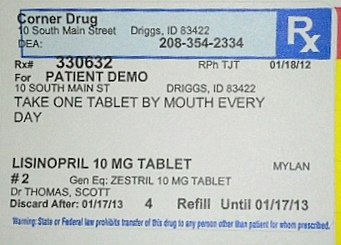

2. Browse to the Logic App detail screen and you will see Run History for the executions. Click the top row which is most recent execution of Logic App and show *Succeeded* as the status. 

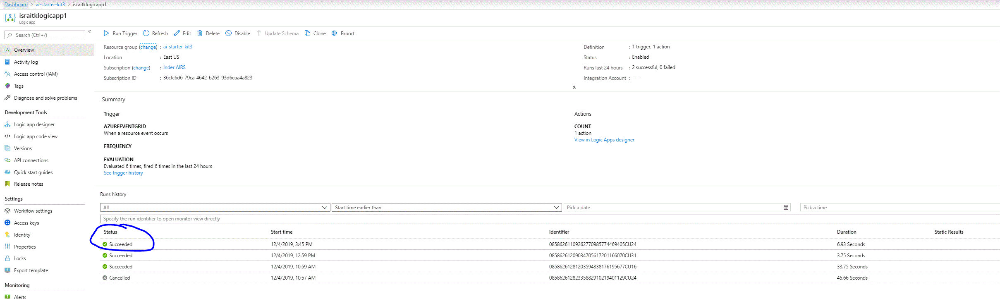

3. Logic App Run detial will be displayed and should show the text from image as the output of the second step.

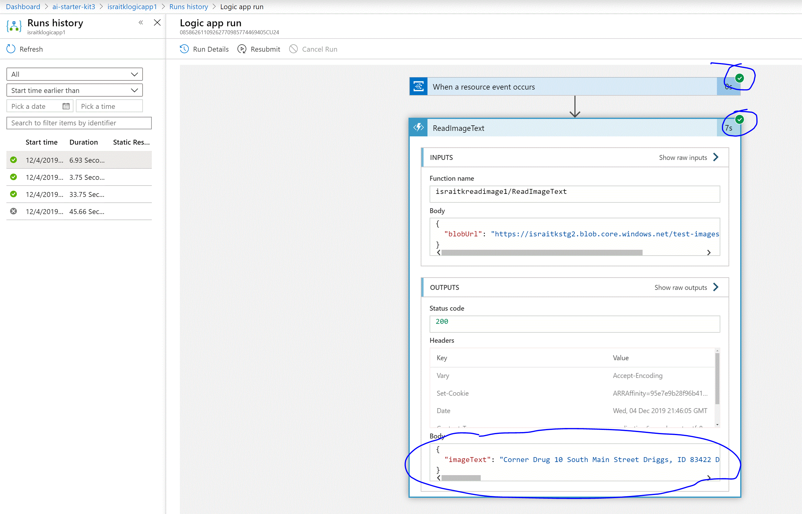

***

## Review

At this point you have a Logic App which uses Azure Functions, AI Capabilities of Azure Computer Vision Cognitive Sevice and Storage Account to identify the text from a medical prescription image.

[Previous Chapter](../chapter4/Readme.md) | Next Chapter (coming soon)
